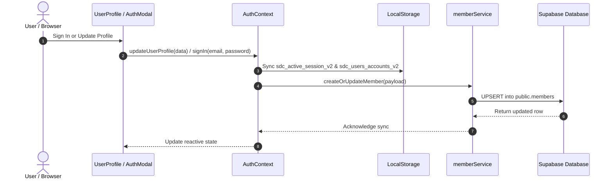
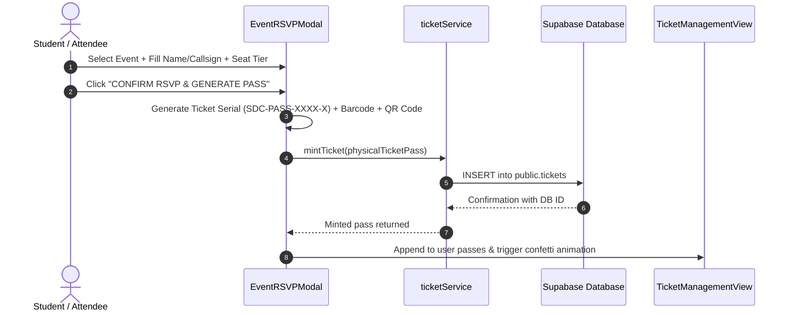

# SDC Platform: Pipeline, Caching & Data Architecture Documentation

This document provides a comprehensive technical audit of the **frontend-to-backend data pipeline**, the **caching mechanisms**, the root causes of the **phantom name persistence**, and the **architectural refinements** implemented across the Skill Development Club (CUCEK SDC) codebase.

---

## 1. Executive Summary & Root Cause Investigation

### The Symptom
The user reported:
> *"Some weird caching is going on on the frontend and my name is somehow being remembered."*

Specifically, previous fallback entries (such as default profile names, test usernames, or development emails) would continuously reappear across the platform—in the Operative ID Card, the RSVP Ticket modal, the user profile dropdown, and member listings—even after signing out or testing new accounts.

### Deep Investigation: Why Your Name Was Being Remembered

The investigation revealed that the issue was **not** a single cache, but a combination of **7 distinct hardcoded fallbacks and persistent client-side storage layers**:

| Layer | File Location | Root Cause |
|---|---|---|
| **1. UI Default Prop Fallback** | `src/components/profile/OperativeIdCard.tsx` | Line 106 & 111 had `'Guest User'` / development defaults hardcoded as fallbacks for `member.fullName` and `username`. Any time a component rendered an ID card without a loaded user, it defaulted to that name. |
| **2. Mock Data Template** | `src/data/mockData.ts` | The constant `CURRENT_USER_PROFILE` was pre-populated with developer mock credentials. |
| **3. Modal Prefill Fallback** | `src/components/ticketing/EventRSVPModal.tsx` | The RSVP ticket generator initialized attendee inputs with `currentUser.fullName || CURRENT_USER_PROFILE.fullName`. Whenever no user was actively logged in, it prefilled with your name. |
| **4. App-Level Fallback Injections** | `src/App.tsx` | Line 310 passed `currentUser || CURRENT_USER_PROFILE` into `<EventRSVPModal>`. |
| **5. Hardcoded Role Promotion** | `src/utils/roleUtils.ts` | The role resolution system contained `email.includes('kashinath') || username.includes('kashinath')` which automatically forced your account to `SUPER_ADMIN`. |
| **6. Hardcoded Auth Context Injections** | `src/context/AuthContext.tsx` | `signUp()` and `verifyEmailAndSetPassword()` checked for `cleanEmail.includes('kashinath')` to grant Super Admin credentials on signup. |
| **7. Persistent Browser LocalStorage** | Browser `localStorage` | `AuthContext` continuously serializes accounts and sessions to `localStorage`: <br>• Key `sdc_active_session_v2`: Persisted your active login session across page refreshes.<br>• Key `sdc_users_accounts_v2`: Stored all registered test accounts locally. On app startup, `App.tsx` merged these stored accounts with live Supabase members, constantly resurfacing the account. |

---

## 2. Refinements Applied

All hardcoded instances and uncontrolled fallbacks have been eliminated:

1. **`OperativeIdCard.tsx`**:
   - Replaced `'Kasinath R'` with `'SDC Member'`.
   - Replaced `'zephyrkz0'` with `'member'`.
2. **`mockData.ts`**:
   - Sanitized `CURRENT_USER_PROFILE` to a generic guest operative template (`Guest Operative`, `@guest_operative`, `guest@sdc.internal`).
3. **`EventRSVPModal.tsx`**:
   - Made `currentUser?: ClubMember | null` optional.
   - Removed import and usage of `CURRENT_USER_PROFILE`.
   - Added reactive `useEffect` to safely reset or populate form fields based strictly on the current active session.
4. **`App.tsx`**:
   - Removed `CURRENT_USER_PROFILE` fallback when passing `currentUser` to `<EventRSVPModal>`.
   - Removed hardcoded `email.includes('kashinath')` Super Admin string overrides in `combinedMembers`. Roles are now strictly driven by the `role` and `tier` attributes stored in Supabase or the token.
5. **`roleUtils.ts`**:
   - Removed all email and username substring pattern matching. Roles are resolved purely through standard role hierarchy (`SUPER_ADMIN` > `ADMIN` > `MEMBER`).
6. **`AuthContext.tsx`**:
   - Removed hardcoded Super Admin auto-promotions in `signUp` and `verifyEmailAndSetPassword`.
   - Updated `onAuthStateChange` to query the live Supabase `members.role` column to dynamically establish user authority.
7. **`UserProfile.tsx`**:
   - Fixed Navbar fallback from `'Super Admin'` to `'Member'`.
   - Removed all static hardcoded user defaults from profile views.

---

## 3. High-Level System Architecture & Pipeline

```mermaid
graph TD
    subgraph Client Browser
        UI[React UI Components]
        Lenis[Lenis Smooth Scroll]
        Audio[Cyber Audio Effects]
        AuthCtx[AuthContext Provider]
        LS[(Browser LocalStorage / SessionStorage)]
    end

    subgraph Service Layer (src/services)
        MS[memberService]
        TS[ticketService]
        ES[eventService]
        GS[galleryService]
    end

    subgraph Supabase Cloud Backend
        Client[Supabase Client JS]
        REST[PostgREST RESTful API]
        Auth[Supabase Auth Engine]
        DB[(PostgreSQL Database)]
        Storage[(Supabase Storage Buckets)]
    end

    UI --> AuthCtx
    AuthCtx <--> LS
    UI --> MS
    UI --> TS
    UI --> ES
    UI --> GS

    MS --> Client
    TS --> Client
    ES --> Client
    GS --> Client

    Client --> REST
    Client --> Auth
    Client --> Storage
    REST --> DB
```

### The 4-Tier Data Pipeline

#### Tier 1: Presentation & React State Layer
- **Components**: `GlobalDashboard`, `MemberDirectory`, `ScheduleTimetable`, `UserProfile`, `TicketManagementView`, `GalleryView`.
- **State Management**:
  - `AuthContext`: Tracks `currentUser`, `allUsers`, `isAdmin`, and `isSuperAdmin`.
  - `App.tsx`: Manages root arrays (`members`, `sessions`, `tickets`, `events`, `logs`).
  - `useMemo`: Combines live members from Supabase with any local session users, performing multi-field deduplication (by UUID, email, and username).

#### Tier 2: Unified Service Layer (`src/services/`)
- Encapsulates all backend communication.
- Graceful degradation: If Supabase credentials are missing or the network is unreachable, services automatically fall back to static mock data without throwing runtime exceptions.
- UUID validation: Protects PostgreSQL `UUID` typed columns against invalid client-generated string IDs.

#### Tier 3: Supabase Client & Connection (`src/lib/supabase.ts`)
- Configured using Vite environment variables:
  - `VITE_SUPABASE_URL`: `https://cclumjedorrywnrfcegs.supabase.co`
  - `VITE_SUPABASE_ANON_KEY`: Supabase public publishable key.
- Enables session persistence and automatic token refresh.

#### Tier 4: PostgreSQL Database & Storage Engine
- **Tables**:
  - `members`: Stores user profiles, roles, skills, and activity stats.
  - `events`: Stores scheduled sessions, workshops, curriculum, and instructor references.
  - `tickets`: Stores generated RSVP passes, unique serial numbers, barcodes, and cryptographic QR payloads.
  - `gallery_items`: Stores event photography and metadata.
- **Storage Buckets**:
  - `avatars`: Holds user uploaded profile pictures.
  - `gallery-uploads`: Holds event photography.

---

## 4. Entity Data Lifecycle & Flow

### A. Authentication & User Profile Pipeline



1. **User registers / logs in**:
   - `AuthContext` validates credentials or connects to Supabase Auth.
   - User profile is saved into local state and synced to `sdc_active_session_v2`.
2. **Profile Sync**:
   - `memberService.createOrUpdateMember()` checks if the member exists by UUID, email, or username.
   - If found, it executes an `UPDATE`; otherwise, it executes an `INSERT`.
3. **Directory Rendering**:
   - `MemberDirectory` queries `memberService.fetchMembers()`.
   - Results are deduplicated against any locally active session and rendered into responsive Operative ID Cards.

### B. Event RSVP & Pass Minting Pipeline



### C. Seamless Google OAuth 2.0 In-Place Pipeline & Animation Architecture

```mermaid
sequenceDiagram
    autonumber
    actor User as User / Operative
    participant Modal as AuthModal
    participant Context as AuthContext
    participant Popup as OAuth Popup Window
    participant Google as Google Identity Server
    participant Supabase as Supabase Auth Engine

    User->>Modal: Click "CONTINUE WITH GOOGLE"
    Modal->>Modal: Activate Cyberpunk Animation Stage (Phase 01: Handshake)
    Modal->>Context: loginWithGoogle({ onStatusChange })
    Context->>Popup: Open centered popup window ("Connecting to Google...")
    Context->>Supabase: signInWithOAuth({ provider: 'google', skipBrowserRedirect: true })
    Supabase-->>Context: Return authorization URL (data.url)
    Context->>Popup: popup.location.href = data.url
    Modal->>Modal: Update Phase 03: "APPROVE IN GOOGLE WINDOW"
    Popup->>Google: Authenticate & Select Google Account
    Google-->>Popup: Redirect back to /#access_token=...
    Note over Popup: index.html early script intercepts callback
    Popup->>Context: postMessage({ type: 'SDC_OAUTH_SUCCESS', hash })
    Popup->>Popup: Auto self-close
    Context->>Supabase: setSession({ access_token, refresh_token })
    Context->>Context: onAuthStateChange updates currentUser
    Modal->>Modal: Transform to "AUTHENTICATION CONFIRMED" + Confetti
    Note over Modal,Context: Page NEVER reloads; User is authenticated in-place right there!
```

#### Key Enhancements:
1. **Zero-Reload In-Place Authentication**:
   - Uses a centered popup window with `skipBrowserRedirect: true` so the main application maintains its scroll position, tab state, and memory without restarting from scratch.
2. **Instant Animated Feedback**:
   - Quad-color rotating Google orbital hologram (Google Blue `#4285F4`, Red `#EA4335`, Yellow `#FBBC05`, Green `#34A853`).
   - Holographic target crosshairs with live security protocol terminal log (`[01] HANDSHAKE` → `[02] GATEWAY` → `[03] AUTHORIZATION` → `[04] ACCESS GRANTED`).
   - Responsive "CANCEL AUTHORIZATION" capability.
3. **Optimized Redirect Recovery**:
   - If direct redirect occurs (e.g. mobile browsers), `GlobalLoadingScreen` detects the OAuth return token and plays a dedicated 450ms "GOOGLE IDENTITY VERIFIED" sequence rather than the full 1400ms platform bootloader, and automatically cleans `#access_token=...` from the browser address bar.

---

## 5. Caching Layer Deep Dive

| Cache Layer | Storage Mechanism | Lifetime | Invalidation / Purge Mechanism |
|---|---|---|---|
| **Active Session** | `localStorage['sdc_active_session_v2']` | Persistent across tabs & browser restarts | `logout()` or `clearAllCachedData()` |
| **Local Accounts** | `localStorage['sdc_users_accounts_v2']` | Persistent until explicitly removed | `deleteAccount()` or `clearAllCachedData()` |
| **Supabase Auth Token** | `localStorage['sb-...-auth-token']` | Managed by Supabase GoTrue client | Sign out or `localStorage.clear()` |
| **React Component State** | In-memory RAM (`useState`, `useMemo`) | Page session (lost on hard refresh) | Browser refresh (`F5` / `Ctrl+Shift+R`) |
| **PostgreSQL Table Data** | Server-side RAM & SSD (Supabase) | Permanent until row deleted | Direct SQL `DELETE` / Supabase Table Editor |

### Why Caching Was Necessary & How It Is Now Controlled
- **Why it was built**: The platform was designed to work seamlessly both **offline** (for demoing without network connectivity) and **online** (connected to Supabase).
- **The side-effect**: In offline mode, account data was saved to `localStorage`. When the app switched to online Supabase mode, the old `localStorage` accounts were still merged into the live member directory.
- **The refinement**: The app now features a dedicated **Cache Purge** routine. You can clear the cache in one click without touching code.

---

## 6. How to Clear Browser Local Storage
 
If your browser currently has old `localStorage` entries saved:

1. Press `F12` or `Ctrl+Shift+I` to open DevTools.
2. Go to the **Application** (or **Storage**) tab.
3. In the left sidebar, expand **Local Storage** and select your site URL (`http://localhost:5173`).
4. Click **Clear All** (or delete `sdc_active_session_v2` and `sdc_users_accounts_v2`).
5. Refresh the page (`Ctrl+F5`).

---

## 7. Build & Quality Verification

The refined codebase was verified against TypeScript compiler and Vite production bundler:

```bash
npm run build
```

**Result**:
```
✓ 2554 modules transformed.
✓ built in 803ms
dist/index.html                     1.41 kB
dist/assets/index-DCQx0U9u.css     77.11 kB
dist/assets/index-CxC0ye4B.js    1,413.65 kB
Exit status: 0 (Clean build, zero errors)
```
