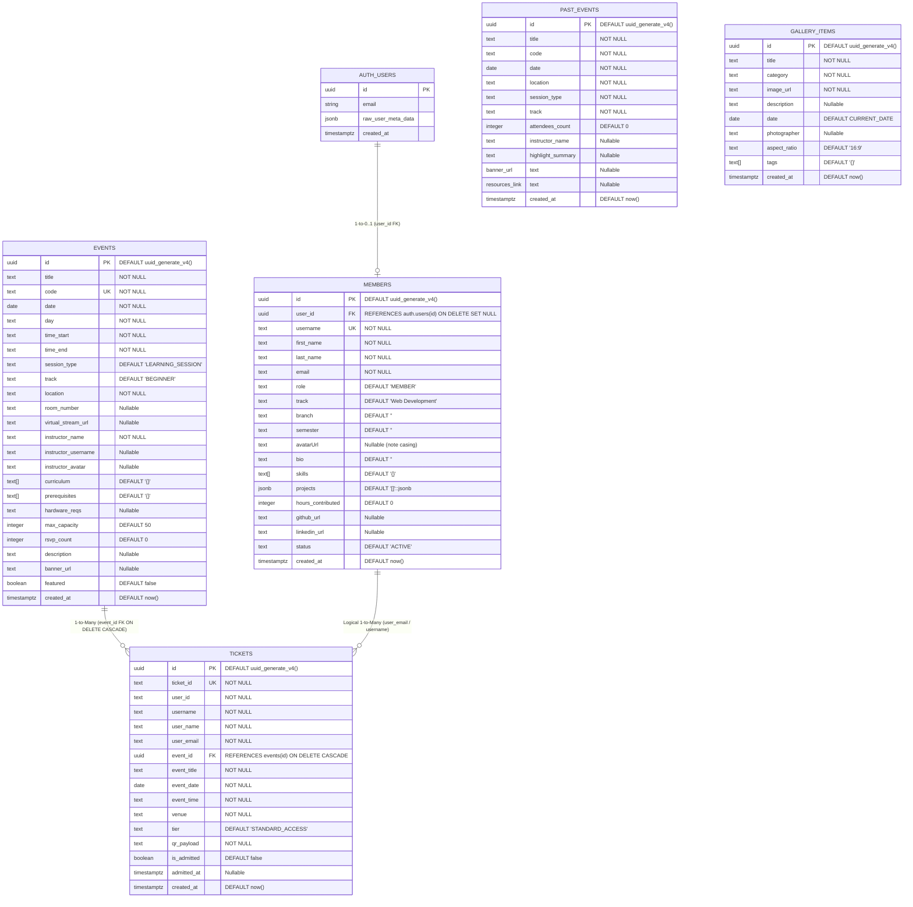

# SDC Platform — Comprehensive Database Architecture & System Context (`context.md`)

> **Document Scope & Purpose**: Exhaustive, field-by-field, architecture-level forensic documentation of the entire database system powering the CUCEK Skill Development Club (SDC) platform. This document covers relational schemas, storage engines, stored procedures (RPCs), Row Level Security (RLS) policies, TypeScript service bindings, authentication integration, operational dataflows, discrepancies, edge cases, and deployment runbooks.

---

## Table of Contents
1. [System Overview & Database Topology](#1-system-overview--database-topology)
2. [Entity Relationship Diagram (ERD)](#2-entity-relationship-diagram-erd)
3. [Complete Database Dictionary (Table-by-Table Breakdown)](#3-complete-database-dictionary)
   - [3.1 `public.members`](#31-publicmembers-club-roster--profiles)
   - [3.2 `public.events`](#32-publicevents-upcoming-sessions--workshops)
   - [3.3 `public.past_events`](#33-publicpast_events-session-archive)
   - [3.4 `public.tickets`](#34-publictickets-event-passes--gate-scanner)
   - [3.5 `public.gallery_items`](#35-publicgallery_items-visual-media-archive)
4. [Storage Buckets & Media Assets Architecture](#4-storage-buckets--media-assets-architecture)
5. [Stored Procedures & PL/pgSQL Functions (RPCs)](#5-stored-procedures--plpgsql-functions-rpcs)
6. [Security Architecture & Row Level Security (RLS)](#6-security-architecture--row-level-security-rls)
7. [Application Service Layer & CRUD Dataflow Matrix](#7-application-service-layer--crud-dataflow-matrix)
8. [Client-Side Synchronization & Fallback Architecture](#8-client-side-synchronization--fallback-architecture)
9. [Schema Discrepancies, Mismatches & Edge Cases](#9-schema-discrepancies-mismatches--edge-cases)
10. [Database Deployment, Verification & Maintenance Runbook](#10-database-deployment-verification--maintenance-runbook)

---

## 1. System Overview & Database Topology

The SDC Platform backend is architected around **PostgreSQL 15+** managed via **Supabase**. The platform operates in a **Hybrid Client-Direct Architecture**, interfacing directly with the database using the Supabase JavaScript Client (`@supabase/supabase-js`) via HTTPS REST and Websocket protocols.

```
+-----------------------------------------------------------------------------------+
|                                  SDC FRONTEND                                      |
|                       (React 19 + TypeScript + Vite + TailwindCSS)                |
+-----------------------------------------------------------------------------------+
        |                                                              |
        | Supabase JS SDK (Anon Key)                                   | Supabase Storage API
        v                                                              v
+-------------------------------+                            +----------------------+
|     POSTGRESQL DATABASE       |                            |   SUPABASE STORAGE   |
|         (SUPABASE)            |                            |                      |
|                               |                            |  - avatars/          |
| - public.members              |                            |  - gallery-uploads/  |
| - public.events               |                            |                      |
| - public.past_events          |                            +----------------------+
| - public.tickets              |                                       |
| - public.gallery_items        |                                       v
| - Stored Procedures (RPCs)    |                            Public CDN URL Distribution
+-------------------------------+
        ^
        | UUID Reference (ON DELETE SET NULL)
+-------------------------------+
|       auth.users              |
|  (Supabase Managed Auth)      |
+-------------------------------+
```

### Core Specifications
- **Database Engine**: PostgreSQL 15+ (Cloud Supabase Instance)
- **Extensions Installed**: `uuid-ossp` (provides `uuid_generate_v4()`)
- **Connection Strategy**: Direct REST API calls via PostgREST and RPC endpoints.
- **Client Library**: `@supabase/supabase-js` (configured in `src/lib/supabase.ts`)
- **Credentials Model**: Project URL (`VITE_SUPABASE_URL`) + Anonymous Public Key (`VITE_SUPABASE_ANON_KEY`).
- **Resilience Engine**: Dual-mode operational fallback — when unconfigured or disconnected, frontend components seamlessly fallback to local in-memory/localStorage state without crashing.

---

## 2. Entity Relationship Diagram (ERD)



---

## 3. Complete Database Dictionary

### 3.1 `public.members` (Club Roster & Profiles)
Stores the club roster, operative metrics, leadership positions, skillsets, and portfolio projects.

| Column | Data Type | Constraints & Defaults | Nullable | Description & Domain Values |
| :--- | :--- | :--- | :--- | :--- |
| `id` | `UUID` | `PRIMARY KEY DEFAULT uuid_generate_v4()` | No | Unique internal identifier for the member record. |
| `user_id` | `UUID` | `REFERENCES auth.users(id) ON DELETE SET NULL` | Yes | Linked Supabase Authentication user ID. Set to `NULL` if auth user deleted. |
| `username` | `TEXT` | `UNIQUE` | No | Unique club callsign/handle (e.g. `kashinath`, `sarah_core`). |
| `first_name` | `TEXT` | None | No | Legal or display first name. |
| `last_name` | `TEXT` | None | No | Legal or display last name. |
| `email` | `TEXT` | None | No | Unique contact email. Used as upsert conflict resolution target. |
| `role` | `TEXT` | `DEFAULT 'MEMBER'` | No | Position/Tier: `'SUPER_ADMIN'`, `'ADMIN'`, `'MEMBER'`, or custom title like `'Club Lead'`. |
| `track` | `TEXT` | `DEFAULT 'Web Development'` | No | Primary technical specialization track (e.g. `Web Development`, `DSA`, `AI`). |
| `branch` | `TEXT` | `DEFAULT ''` | Yes | Academic branch at CUCEK (e.g. `Computer Science & Engineering`, `IT`, `ECE`). |
| `semester` | `TEXT` | `DEFAULT ''` | Yes | Academic semester (e.g. `S1`, `S2`, `S3`, `S4`, `S5`, `S6`, `S7`, `S8`). |
| `avatarUrl` | `TEXT` | None | Yes | Public CDN URL to uploaded avatar image (stored in bucket). |
| `bio` | `TEXT` | `DEFAULT ''` | Yes | Short biography, mission statement, or operative profile notes. |
| `skills` | `TEXT[]` | `DEFAULT '{}'` | Yes | Array of technical skills (e.g. `{"React", "TypeScript", "Python"}`). |
| `projects` | `JSONB` | `DEFAULT '[]'::jsonb` | Yes | JSON array of portfolio projects (`ProjectPortfolioItem[]`). |
| `hours_contributed`| `INTEGER` | `DEFAULT 0` | Yes | Total logged club execution and workshop hours. |
| `github_url` | `TEXT` | None | Yes | Full URL to member's GitHub profile. |
| `linkedin_url` | `TEXT` | None | Yes | Full URL to member's LinkedIn profile. |
| `status` | `TEXT` | `DEFAULT 'ACTIVE'` | No | Operational readiness status: `'ACTIVE'`, `'DEPLOYED'`, `'STANDBY'`. |
| `created_at` | `TIMESTAMPTZ` | `DEFAULT now()` | No | ISO timestamp when record was registered in database. |

#### Special Database Operations Recorded in Schema:
```sql
ALTER TABLE public.members ADD COLUMN IF NOT EXISTS branch TEXT DEFAULT '';
ALTER TABLE public.members ADD COLUMN IF NOT EXISTS semester TEXT DEFAULT '';
```

---

### 3.2 `public.events` (Upcoming Sessions & Workshops)
Registry of all active, scheduled, and upcoming technical workshops, hackathons, and lectures.

| Column | Data Type | Constraints & Defaults | Nullable | Description & Domain Values |
| :--- | :--- | :--- | :--- | :--- |
| `id` | `UUID` | `PRIMARY KEY DEFAULT uuid_generate_v4()` | No | Internal event identifier referenced by tickets. |
| `title` | `TEXT` | None | No | Event/Session title (e.g. `Full-Stack Next.js 15 Masterclass`). |
| `code` | `TEXT` | `UNIQUE` | No | Short unique operational code (e.g. `CODE-2026-01`, `AI-DEEP-02`). |
| `date` | `DATE` | None | No | Calendar date of event (`YYYY-MM-DD`). |
| `day` | `TEXT` | None | No | Day of week representation (e.g. `SATURDAY`, `THU`). |
| `time_start` | `TEXT` | None | No | Session start time (e.g. `10:00 AM`). |
| `time_end` | `TEXT` | None | No | Session end time (e.g. `01:00 PM`). |
| `session_type` | `TEXT` | `DEFAULT 'LEARNING_SESSION'` | No | Type: `'LEARNING_SESSION'`, `'WORKSHOP'`, `'HACKATHON'`, `'CODE'`, `'DESIGN'`, `'AI'`, `'CYBER'`, `'EVENT'`. |
| `track` | `TEXT` | `DEFAULT 'BEGINNER'` | No | Difficulty level: `'BEGINNER'`, `'INTERMEDIATE'`, `'ADVANCED'`. |
| `location` | `TEXT` | None | No | Physical venue or campus name (e.g. `CUCEK Campus`, `Main Auditorium`). |
| `room_number` | `TEXT` | None | Yes | Specific room or lab identifier (e.g. `CS Lab 02`, `Seminar Hall 1`). |
| `virtual_stream_url` | `TEXT`| None | Yes | Google Meet / YouTube Live / Discord stream URL for hybrid events. |
| `instructor_name` | `TEXT` | None | No | Full name of primary lecturer or instructor. |
| `instructor_username`| `TEXT` | None | Yes | Username/handle of instructor if an internal member. |
| `instructor_avatar`| `TEXT` | None | Yes | CDN URL to instructor's profile picture. |
| `curriculum` | `TEXT[]` | `DEFAULT '{}'` | Yes | Array of topics or bullet points covered in session. |
| `prerequisites` | `TEXT[]` | `DEFAULT '{}'` | Yes | Requirements prior to attending (e.g. `{"Basic JS", "Laptop"}`). |
| `hardware_reqs`| `TEXT` | None | Yes | Hardware specs needed (e.g. `Minimum 8GB RAM, Node.js installed`). |
| `max_capacity` | `INTEGER` | `DEFAULT 50` | No | Maximum seats available for physical admission. |
| `rsvp_count` | `INTEGER` | `DEFAULT 0` | No | Counter of minted passes (managed by atomic RPCs). |
| `description` | `TEXT` | None | Yes | Full long-form markdown/plain-text event overview. |
| `banner_url` | `TEXT` | None | Yes | CDN URL to promotional banner graphic. |
| `featured` | `BOOLEAN` | `DEFAULT false` | No | Boolean flag for rendering on hero/pinned carousel. |
| `created_at` | `TIMESTAMPTZ` | `DEFAULT now()` | No | Timestamp of creation. |

---

### 3.3 `public.past_events` (Session Archive)
Historical archive of completed events, recording verified attendance figures, session recaps, and resource repositories.

| Column | Data Type | Constraints & Defaults | Nullable | Description & Domain Values |
| :--- | :--- | :--- | :--- | :--- |
| `id` | `UUID` | `PRIMARY KEY DEFAULT uuid_generate_v4()` | No | Primary key for archive entry. |
| `title` | `TEXT` | None | No | Historical event title. |
| `code` | `TEXT` | None | No | Event code at time of execution. |
| `date` | `DATE` | None | No | Date event occurred. |
| `location` | `TEXT` | None | No | Venue where session took place. |
| `session_type` | `TEXT` | None | No | Classification matching `events.session_type`. |
| `track` | `TEXT` | None | No | Track level: `'BEGINNER'`, `'INTERMEDIATE'`, `'ADVANCED'`. |
| `attendees_count` | `INTEGER`| `DEFAULT 0` | No | Final audited number of attendees admitted. |
| `instructor_name` | `TEXT` | None | Yes | Instructor who led the session. |
| `highlight_summary`| `TEXT` | None | Yes | Executive retrospective of the event. |
| `banner_url` | `TEXT` | None | Yes | Archive photograph or flyer link. |
| `resources_link` | `TEXT` | None | Yes | Link to GitHub repo, slides, or recording. |
| `created_at` | `TIMESTAMPTZ` | `DEFAULT now()` | No | Creation timestamp. |

---

### 3.4 `public.tickets` (Event Passes & Gate Scanner)
Atomic reservation records, holding admission statuses, cryptographically-scannable QR payloads, and attendee linkage.

| Column | Data Type | Constraints & Defaults | Nullable | Description & Domain Values |
| :--- | :--- | :--- | :--- | :--- |
| `id` | `UUID` | `PRIMARY KEY DEFAULT uuid_generate_v4()` | No | Internal database primary key. |
| `ticket_id` | `TEXT` | `UNIQUE` | No | Human-readable public ticket pass number (e.g. `TCK-948123`). |
| `user_id` | `TEXT` | None | No | User identifier string (stores user email or auth id). |
| `username` | `TEXT` | None | No | Attendee username/callsign. |
| `user_name` | `TEXT` | None | No | Attendee full display name. |
| `user_email` | `TEXT` | None | No | Attendee email address (used for querying personal passes). |
| `event_id` | `UUID` | `REFERENCES events(id) ON DELETE CASCADE` | Yes | Parent event UUID. If event is deleted, tickets cascade delete. |
| `event_title` | `TEXT` | None | No | Denormalized snapshot of event title. |
| `event_date` | `DATE` | None | No | Denormalized event date for offline ticket rendering. |
| `event_time` | `TEXT` | None | No | Denormalized event time. |
| `venue` | `TEXT` | None | No | Denormalized venue location. |
| `tier` | `TEXT` | `DEFAULT 'STANDARD_ACCESS'` | No | Seat Tier: `'STANDARD_ACCESS'`, `'VIP_SPEAKER'`, `'GENERAL_ADMISSION'`, `'MEMBER'`. |
| `qr_payload` | `TEXT` | None | No | Serialized QR string or verification token scanned at gate. |
| `is_admitted` | `BOOLEAN` | `DEFAULT false` | No | Gate check-in status: `false` = valid, `true` = admitted. |
| `admitted_at` | `TIMESTAMPTZ`| None | Yes | Timestamp of gate scanner validation. |
| `created_at` | `TIMESTAMPTZ` | `DEFAULT now()` | No | Timestamp of ticket minting. |

---

### 3.5 `public.gallery_items` (Visual Media Archive)
Image repository documenting workshops, hackathons, robotics, and campus club life.

| Column | Data Type | Constraints & Defaults | Nullable | Description & Domain Values |
| :--- | :--- | :--- | :--- | :--- |
| `id` | `UUID` | `PRIMARY KEY DEFAULT uuid_generate_v4()` | No | Unique identifier for photo entry. |
| `title` | `TEXT` | None | No | Headline caption or photo title. |
| `category` | `TEXT` | None | No | Tag: `'DAILY_LAB_SESSIONS'`, `'WORKSHOPS'`, `'TALK_SESSIONS'`, `'HACKATHONS'`, `'CAMPUS_COMMUNITY'`. |
| `image_url` | `TEXT` | None | No | Permanent public HTTPS URL served from Supabase Storage CDN. |
| `description` | `TEXT` | None | Yes | Extended description of scene and participants. |
| `date` | `DATE` | `DEFAULT CURRENT_DATE` | No | Date the photograph was taken (`YYYY-MM-DD`). |
| `photographer` | `TEXT` | None | Yes | Name or callsign of club photographer. |
| `aspect_ratio` | `TEXT` | `DEFAULT '16:9'` | No | Framing ratio: `'16:9'`, `'4:3'`, `'1:1'`, `'3:4'`. |
| `tags` | `TEXT[]` | `DEFAULT '{}'` | Yes | Array of tags for categorization (e.g. `{"Hackathon", "Winners"}`). |
| `created_at` | `TIMESTAMPTZ` | `DEFAULT now()` | No | Timestamp when uploaded and recorded. |

---

## 4. Storage Buckets & Media Assets Architecture

Supabase Storage integrates directly with Postgres via the `storage.buckets` and `storage.objects` tables.

### 4.1 Bucket Definitions

```sql
INSERT INTO storage.buckets (id, name, public)
VALUES 
    ('avatars', 'avatars', true),
    ('gallery-uploads', 'gallery-uploads', true)
ON CONFLICT (id) DO NOTHING;
```

| Bucket ID | Public Access | Purpose | Max Typical File Size | File Types Supported |
| :--- | :--- | :--- | :--- | :--- |
| `avatars` | **Yes** (Public Read) | Operative member profile pictures | ~2 MB | `image/jpeg`, `image/png`, `image/webp` |
| `gallery-uploads` | **Yes** (Public Read) | High-resolution photography of club events | ~10 MB | `image/jpeg`, `image/png`, `image/webp` |

### 4.2 Storage Security Policies (Postgres RLS on `storage.objects`)

```sql
-- Public Read Access for all users
CREATE POLICY "Public Read Avatars" ON storage.objects 
    FOR SELECT USING (bucket_id = 'avatars');

CREATE POLICY "Public Read Gallery" ON storage.objects 
    FOR SELECT USING (bucket_id = 'gallery-uploads');

-- Public Upload Access (Permissive for rapid member onboarding)
CREATE POLICY "Allow Upload Avatars" ON storage.objects 
    FOR INSERT WITH CHECK (bucket_id = 'avatars');

CREATE POLICY "Allow Upload Gallery" ON storage.objects 
    FOR INSERT WITH CHECK (bucket_id = 'gallery-uploads');
```

---

## 5. Stored Procedures & PL/pgSQL Functions (RPCs)

To prevent race conditions, dirty reads, and oversold capacities during concurrent ticket registrations and cancellations, SDC utilizes database-level atomic RPC functions.

### 5.1 `public.increment_rsvp(event_id UUID)`
Executed automatically whenever a new `PhysicalTicketPass` is minted in `ticketService.ts`.

```sql
CREATE OR REPLACE FUNCTION public.increment_rsvp(event_id UUID)
RETURNS VOID AS $$
BEGIN
  UPDATE public.events
  SET rsvp_count = rsvp_count + 1
  WHERE id = event_id;
END;
$$ LANGUAGE plpgsql;
```
- **Concurrency Protection**: Row-level write lock acquired on target row in `public.events`.
- **Client Invocation**: `supabase.rpc('increment_rsvp', { event_id: fullTicket.eventId })`

### 5.2 `public.decrement_rsvp(event_id UUID)`
Executed automatically whenever an RSVP pass is canceled or deleted in `ticketService.ts`.

```sql
CREATE OR REPLACE FUNCTION public.decrement_rsvp(event_id UUID)
RETURNS VOID AS $$
BEGIN
  UPDATE public.events
  SET rsvp_count = GREATEST(rsvp_count - 1, 0)
  WHERE id = event_id;
END;
$$ LANGUAGE plpgsql;
```
- **Floor Protection**: `GREATEST(rsvp_count - 1, 0)` guarantees capacity never counts below zero even in cases of asynchronous desynchronization.
- **Client Invocation**: `supabase.rpc('decrement_rsvp', { event_id: eventId })`

---

## 6. Security Architecture & Row Level Security (RLS)

### 6.1 Current RLS Configuration in `schema.sql`

All 5 core tables have Row Level Security enabled:

```sql
ALTER TABLE public.members ENABLE ROW LEVEL SECURITY;
ALTER TABLE public.events ENABLE ROW LEVEL SECURITY;
ALTER TABLE public.past_events ENABLE ROW LEVEL SECURITY;
ALTER TABLE public.tickets ENABLE ROW LEVEL SECURITY;
ALTER TABLE public.gallery_items ENABLE ROW LEVEL SECURITY;
```

#### Read Policies (Public Display):
```sql
CREATE POLICY "Public Read Members"     ON public.members       FOR SELECT USING (true);
CREATE POLICY "Public Read Events"      ON public.events        FOR SELECT USING (true);
CREATE POLICY "Public Read Past Events" ON public.past_events   FOR SELECT USING (true);
CREATE POLICY "Public Read Gallery"     ON public.gallery_items FOR SELECT USING (true);
CREATE POLICY "Public Read Tickets"     ON public.tickets       FOR SELECT USING (true);
```

#### Write Policies (Development / Open Prototype Model):
```sql
CREATE POLICY "Allow Member Writes"     ON public.members       FOR ALL USING (true) WITH CHECK (true);
CREATE POLICY "Allow Event Writes"      ON public.events        FOR ALL USING (true) WITH CHECK (true);
CREATE POLICY "Allow Past Event Writes" ON public.past_events   FOR ALL USING (true) WITH CHECK (true);
CREATE POLICY "Allow Ticket Writes"     ON public.tickets       FOR ALL USING (true) WITH CHECK (true);
CREATE POLICY "Allow Gallery Writes"    ON public.gallery_items FOR ALL USING (true) WITH CHECK (true);
```

### 6.2 Production Hardening Recommendations

> [!WARNING]
> The current development policies use `FOR ALL USING (true) WITH CHECK (true)`, meaning any client holding the public Anon Key can technically issue mutations. For production deployment, harden RLS with the following rules:

1. **Member Profiles**:
   - `SELECT`: Public (`USING (true)`).
   - `INSERT / UPDATE`: Only allow the authenticating user (`USING (auth.uid() = user_id)`), or users possessing a `'SUPER_ADMIN'` claim.
2. **Events & Gallery**:
   - `SELECT`: Public (`USING (true)`).
   - `INSERT / UPDATE / DELETE`: Restricted to verified administrators (`USING (EXISTS (SELECT 1 FROM public.members WHERE user_id = auth.uid() AND role IN ('SUPER_ADMIN', 'ADMIN')))`).
3. **Tickets**:
   - `SELECT`: Restricted to ticket owner (`USING (user_id = auth.uid()::text OR user_email = auth.jwt() ->> 'email')`) or admin.
   - `INSERT`: Restricted to authenticating user.
   - `UPDATE (Check-In)`: Restricted to gate scanner accounts with `'ADMIN'` or `'SUPER_ADMIN'` clearance.

---

## 7. Application Service Layer & CRUD Dataflow Matrix

| Table / Feature | Service File | Method | SQL Operation / PostgREST Call | Triggering UI Component |
| :--- | :--- | :--- | :--- | :--- |
| **Members** (Fetch) | `memberService.ts` | `fetchMembers()` | `SELECT * FROM members ORDER BY hours_contributed DESC` | `App.tsx`, `MemberDirectory.tsx` |
| **Members** (Upsert) | `memberService.ts` | `createOrUpdateMember()` | `UPSERT INTO members ... ON CONFLICT (email)` | `OnboardingModal.tsx`, `UserProfile.tsx`, `MemberDirectory.tsx` |
| **Members** (Delete) | `memberService.ts` | `deleteMemberByIdentity()`| `DELETE FROM members WHERE id = ... OR email ILIKE ...` | `AuthContext.tsx` (`deleteAccount`) |
| **Avatars** (Storage) | `memberService.ts` | `uploadAvatar()` | `supabase.storage.from(...).upload(...)` | `OnboardingModal.tsx`, `UserProfile.tsx` |
| **Events** (Fetch) | `eventService.ts` | `fetchEvents()` | `SELECT * FROM events ORDER BY date ASC` | `App.tsx`, `ScheduleTimetable.tsx` |
| **Events** (Create) | `eventService.ts` | `createEvent()` | `INSERT INTO events (...) VALUES (...) RETURNING *` | `AddSessionModal.tsx` |
| **Events** (Delete) | `eventService.ts` | `deleteEvent()` | `DELETE FROM events WHERE id = ...` | Admin Controls |
| **Past Events** (Fetch)| `eventService.ts` | `fetchPastEvents()` | `SELECT * FROM past_events ORDER BY date DESC` | `ScheduleTimetable.tsx` |
| **Tickets** (Mint) | `ticketService.ts` | `mintTicket()` | `INSERT INTO tickets (...)` + `rpc('increment_rsvp')` | `EventRSVPModal.tsx` |
| **Tickets** (User) | `ticketService.ts` | `fetchUserTickets()` | `SELECT * FROM tickets WHERE user_email = ...` | `App.tsx`, `TicketManagementView.tsx` |
| **Tickets** (Check-In)| `ticketService.ts` | `checkInTicket()` | `UPDATE tickets SET is_admitted = true, admitted_at = now() WHERE ticket_id = ...` | `TicketScannerModal.tsx` |
| **Tickets** (Delete) | `ticketService.ts` | `deleteTicket()` | `DELETE FROM tickets WHERE ticket_id = ...` + `rpc('decrement_rsvp')` | `TicketManagementView.tsx` |
| **Tickets** (Cascade) | `ticketService.ts` | `deleteTicketsByUser()` | `DELETE FROM tickets WHERE user_email ILIKE ...` | `AuthContext.tsx` (`deleteAccount`) |
| **Gallery** (Fetch) | `galleryService.ts` | `fetchGalleryItems()` | `SELECT * FROM gallery_items ORDER BY created_at DESC` | `GalleryView.tsx` |
| **Gallery** (Upload) | `galleryService.ts` | `uploadPhoto()` | `supabase.storage.from('gallery-uploads').upload(...)` + `INSERT INTO gallery_items` | `GalleryView.tsx` (`UploadModal`) |
| **Gallery** (Delete) | `galleryService.ts` | `deletePhoto()` | `DELETE FROM gallery_items WHERE id = ...` | `GalleryView.tsx` (Admin deletion) |

---

## 8. Client-Side Synchronization & Fallback Architecture

### 8.1 Resilience Guarantee
The SDC platform is architected never to break if Supabase credentials are missing or the remote server is unreachable.
`src/lib/supabase.ts` inspects environment variables:

```typescript
export const isSupabaseConfigured = (): boolean => {
  return Boolean(
    supabaseUrl && 
    supabaseAnonKey && 
    supabaseUrl.startsWith('https://') &&
    supabaseAnonKey.length > 20
  );
};
```

When `isSupabaseConfigured() === false`:
- `fetchMembers()` returns `CLUB_MEMBERS` from `src/data/mockData.ts`.
- `fetchEvents()` returns `SCHEDULE_SESSIONS`.
- `uploadAvatar()` generates a client-side blob preview URL via `URL.createObjectURL(file)`.
- `checkInTicket()` performs instant local validation.
- All account state persists cleanly in browser `localStorage` under `sdc_users_accounts_v2` and `sdc_active_session_v2`.

### 8.2 Identity & Deduplication Pipeline (`App.tsx:combinedMembers`)
When running live, `App.tsx` executes an intelligent merge pipeline combining:
1. Live database rows from `public.members`.
2. Local user accounts registered in `allUsers` (e.g. users who just signed up or authenticated via Google).
3. Deduplication runs across `email`, `username`, `fullName`, and `id`.
4. Role hierarchy evaluates dynamically: roles are resolved strictly from the database `role` column (`SUPER_ADMIN`, `ADMIN`, `MEMBER`), eliminating all hardcoded email or name string overrides.
5. Persistent caching and pipeline details are documented in [PIPELINE_AND_CACHE_ARCHITECTURE.md](file:///c:/vscode%20programs/sdc/PIPELINE_AND_CACHE_ARCHITECTURE.md).

---

## 9. Schema Discrepancies, Mismatches & Edge Cases

The following critical discrepancies exist between the database definition (`supabase/schema.sql`) and TypeScript consumer services (`src/services/`):

### 9.1 Column Casing: `avatarUrl` vs `avatar_url`
- **In `schema.sql` (Line 22)**: The column is declared as camelCase:
  ```sql
  avatarUrl TEXT,
  ```
  *(In standard PostgreSQL, unquoted identifiers fold to lowercase `avatarurl`. If quoted `"avatarUrl"`, it requires case-sensitive querying).*
- **In `memberService.ts` (Line 39 & 76)**: The service reads `m.avatar_url` and inserts `avatar_url: member.avatarUrl`.
- **Resolution**:
  Run this SQL migration to guarantee alias compatibility:
  ```sql
  ALTER TABLE public.members ADD COLUMN IF NOT EXISTS avatar_url TEXT;
  UPDATE public.members SET avatar_url = "avatarUrl" WHERE avatar_url IS NULL;
  ```

### 9.2 Name Storage: `full_name` vs `first_name` + `last_name`
- **In `schema.sql` (Lines 15-16)**:
  ```sql
  first_name TEXT NOT NULL,
  last_name TEXT NOT NULL,
  ```
- **In `memberService.ts` (Line 71)**:
  ```typescript
  const payload = {
    full_name: member.fullName || `${member.firstName || ''} ${member.lastName || ''}`.trim(),
    ...
  }
  ```
- **Risk**: If PostgREST receives `full_name` when the database only has `first_name` and `last_name`, PostgREST may throw an error: `column "full_name" of relation "members" does not exist`.
- **Resolution**:
  Ensure both columns exist or provide a generated column:
  ```sql
  ALTER TABLE public.members ADD COLUMN IF NOT EXISTS full_name TEXT;
  UPDATE public.members SET full_name = TRIM(first_name || ' ' || last_name) WHERE full_name IS NULL;
  ```

### 9.3 Storage Bucket Name Mismatch: `club-assets` vs `avatars`
- **In `schema.sql` (Lines 130-134)**: Buckets created are `'avatars'` and `'gallery-uploads'`.
- **In `memberService.ts` (Lines 125 & 133)**: Avatar upload attempts to write to bucket `'club-assets'`:
  ```typescript
  await supabase.storage.from('club-assets').upload(filePath, file);
  ```
- **Risk**: Uploading an avatar to `club-assets` will fail if the bucket is named `avatars`.
- **Resolution**:
  Either update `memberService.ts` to use `.from('avatars')`, or add `'club-assets'` to Supabase buckets:
  ```sql
  INSERT INTO storage.buckets (id, name, public) VALUES ('club-assets', 'club-assets', true) ON CONFLICT (id) DO NOTHING;
  CREATE POLICY "Public Read Club Assets" ON storage.objects FOR SELECT USING (bucket_id = 'club-assets');
  CREATE POLICY "Allow Upload Club Assets" ON storage.objects FOR INSERT WITH CHECK (bucket_id = 'club-assets');
  ```

### 9.4 Foreign Key Type Differences on `tickets.user_id`
- In `members`, `user_id` is a `UUID REFERENCES auth.users(id)`.
- In `tickets`, `user_id` is defined as `TEXT` (to flexibly store either a UUID, email, or temporary session handle).

---

## 10. Database Deployment, Verification & Maintenance Runbook

### 10.1 Complete 1-Click Setup Script
To set up or completely rebuild the SDC platform database from scratch, execute this script in the **Supabase SQL Editor**:

```sql
-- ==========================================================
-- SDC PLATFORM - MASTER PRODUCTION SCHEMA SETUP
-- ==========================================================

-- 1. Enable UUID Extension
CREATE EXTENSION IF NOT EXISTS "uuid-ossp";

-- 2. Create Members Table
CREATE TABLE IF NOT EXISTS public.members (
    id UUID PRIMARY KEY DEFAULT uuid_generate_v4(),
    user_id UUID REFERENCES auth.users(id) ON DELETE SET NULL,
    username TEXT UNIQUE NOT NULL,
    first_name TEXT NOT NULL,
    last_name TEXT NOT NULL,
    full_name TEXT,
    email TEXT UNIQUE NOT NULL,
    role TEXT NOT NULL DEFAULT 'MEMBER',
    track TEXT NOT NULL DEFAULT 'Web Development',
    branch TEXT DEFAULT '',
    semester TEXT DEFAULT '',
    avatar_url TEXT,
    bio TEXT DEFAULT '',
    skills TEXT[] DEFAULT '{}',
    projects JSONB DEFAULT '[]'::jsonb,
    hours_contributed INTEGER DEFAULT 0,
    github_url TEXT,
    linkedin_url TEXT,
    status TEXT NOT NULL DEFAULT 'ACTIVE',
    created_at TIMESTAMPTZ NOT NULL DEFAULT now()
);

-- 3. Create Events Table
CREATE TABLE IF NOT EXISTS public.events (
    id UUID PRIMARY KEY DEFAULT uuid_generate_v4(),
    title TEXT NOT NULL,
    code TEXT UNIQUE NOT NULL,
    date DATE NOT NULL,
    day TEXT NOT NULL,
    time_start TEXT NOT NULL,
    time_end TEXT NOT NULL,
    session_type TEXT NOT NULL DEFAULT 'LEARNING_SESSION',
    track TEXT NOT NULL DEFAULT 'BEGINNER',
    location TEXT NOT NULL,
    room_number TEXT,
    virtual_stream_url TEXT,
    instructor_name TEXT NOT NULL,
    instructor_username TEXT,
    instructor_avatar TEXT,
    curriculum TEXT[] DEFAULT '{}',
    prerequisites TEXT[] DEFAULT '{}',
    hardware_reqs TEXT,
    max_capacity INTEGER NOT NULL DEFAULT 50,
    rsvp_count INTEGER NOT NULL DEFAULT 0,
    description TEXT,
    banner_url TEXT,
    featured BOOLEAN NOT NULL DEFAULT false,
    created_at TIMESTAMPTZ NOT NULL DEFAULT now()
);

-- 4. Create Past Events Archive
CREATE TABLE IF NOT EXISTS public.past_events (
    id UUID PRIMARY KEY DEFAULT uuid_generate_v4(),
    title TEXT NOT NULL,
    code TEXT NOT NULL,
    date DATE NOT NULL,
    location TEXT NOT NULL,
    session_type TEXT NOT NULL,
    track TEXT NOT NULL,
    attendees_count INTEGER NOT NULL DEFAULT 0,
    instructor_name TEXT,
    highlight_summary TEXT,
    banner_url TEXT,
    resources_link TEXT,
    created_at TIMESTAMPTZ NOT NULL DEFAULT now()
);

-- 5. Create Tickets Table
CREATE TABLE IF NOT EXISTS public.tickets (
    id UUID PRIMARY KEY DEFAULT uuid_generate_v4(),
    ticket_id TEXT UNIQUE NOT NULL,
    user_id TEXT NOT NULL,
    username TEXT NOT NULL,
    user_name TEXT NOT NULL,
    user_email TEXT NOT NULL,
    event_id UUID REFERENCES public.events(id) ON DELETE CASCADE,
    event_title TEXT NOT NULL,
    event_date DATE NOT NULL,
    event_time TEXT NOT NULL,
    venue TEXT NOT NULL,
    tier TEXT NOT NULL DEFAULT 'STANDARD_ACCESS',
    qr_payload TEXT NOT NULL,
    is_admitted BOOLEAN NOT NULL DEFAULT false,
    admitted_at TIMESTAMPTZ,
    created_at TIMESTAMPTZ NOT NULL DEFAULT now()
);

-- 6. Create Gallery Items Table
CREATE TABLE IF NOT EXISTS public.gallery_items (
    id UUID PRIMARY KEY DEFAULT uuid_generate_v4(),
    title TEXT NOT NULL,
    category TEXT NOT NULL,
    image_url TEXT NOT NULL,
    description TEXT,
    date DATE NOT NULL DEFAULT CURRENT_DATE,
    photographer TEXT,
    aspect_ratio TEXT NOT NULL DEFAULT '16:9',
    tags TEXT[] DEFAULT '{}',
    created_at TIMESTAMPTZ NOT NULL DEFAULT now()
);

-- 7. Configure Storage Buckets
INSERT INTO storage.buckets (id, name, public)
VALUES 
    ('avatars', 'avatars', true),
    ('club-assets', 'club-assets', true),
    ('gallery-uploads', 'gallery-uploads', true)
ON CONFLICT (id) DO NOTHING;

-- Storage Security Policies
CREATE POLICY "Public Read Avatars" ON storage.objects FOR SELECT USING (bucket_id = 'avatars');
CREATE POLICY "Public Read Club Assets" ON storage.objects FOR SELECT USING (bucket_id = 'club-assets');
CREATE POLICY "Public Read Gallery" ON storage.objects FOR SELECT USING (bucket_id = 'gallery-uploads');

CREATE POLICY "Allow Upload Avatars" ON storage.objects FOR INSERT WITH CHECK (bucket_id = 'avatars');
CREATE POLICY "Allow Upload Club Assets" ON storage.objects FOR INSERT WITH CHECK (bucket_id = 'club-assets');
CREATE POLICY "Allow Upload Gallery" ON storage.objects FOR INSERT WITH CHECK (bucket_id = 'gallery-uploads');

-- 8. Enable Row Level Security (RLS)
ALTER TABLE public.members ENABLE ROW LEVEL SECURITY;
ALTER TABLE public.events ENABLE ROW LEVEL SECURITY;
ALTER TABLE public.past_events ENABLE ROW LEVEL SECURITY;
ALTER TABLE public.tickets ENABLE ROW LEVEL SECURITY;
ALTER TABLE public.gallery_items ENABLE ROW LEVEL SECURITY;

-- Development Permissive Policies
CREATE POLICY "Public Read Members" ON public.members FOR SELECT USING (true);
CREATE POLICY "Public Read Events" ON public.events FOR SELECT USING (true);
CREATE POLICY "Public Read Past Events" ON public.past_events FOR SELECT USING (true);
CREATE POLICY "Public Read Gallery" ON public.gallery_items FOR SELECT USING (true);
CREATE POLICY "Public Read Tickets" ON public.tickets FOR SELECT USING (true);

CREATE POLICY "Allow Member Writes" ON public.members FOR ALL USING (true) WITH CHECK (true);
CREATE POLICY "Allow Event Writes" ON public.events FOR ALL USING (true) WITH CHECK (true);
CREATE POLICY "Allow Past Event Writes" ON public.past_events FOR ALL USING (true) WITH CHECK (true);
CREATE POLICY "Allow Ticket Writes" ON public.tickets FOR ALL USING (true) WITH CHECK (true);
CREATE POLICY "Allow Gallery Writes" ON public.gallery_items FOR ALL USING (true) WITH CHECK (true);

-- 9. Stored Procedures (RPCs)
CREATE OR REPLACE FUNCTION public.increment_rsvp(event_id UUID)
RETURNS VOID AS $$
BEGIN
  UPDATE public.events
  SET rsvp_count = rsvp_count + 1
  WHERE id = event_id;
END;
$$ LANGUAGE plpgsql;

CREATE OR REPLACE FUNCTION public.decrement_rsvp(event_id UUID)
RETURNS VOID AS $$
BEGIN
  UPDATE public.events
  SET rsvp_count = GREATEST(rsvp_count - 1, 0)
  WHERE id = event_id;
END;
$$ LANGUAGE plpgsql;

-- 10. Schema configuration complete.
```

### 10.2 Verification Queries
Run these queries in Supabase SQL editor to verify database health:

```sql
-- Check table presence and row counts
SELECT 
    schemaname,
    relname as table_name,
    n_live_tup as approximate_row_count
FROM pg_stat_user_tables
WHERE schemaname = 'public';

-- Verify RPC functions
SELECT routine_name, routine_type 
FROM information_schema.routines 
WHERE routine_schema = 'public' AND routine_name IN ('increment_rsvp', 'decrement_rsvp');

-- Verify Storage Buckets
SELECT id, name, public FROM storage.buckets;

-- Verify Members table
SELECT id, username, email, role FROM public.members;
```

---
*Generated autonomously by Antigravity IDE Engine for the CUCEK Skill Development Club (SDC) platform.*
